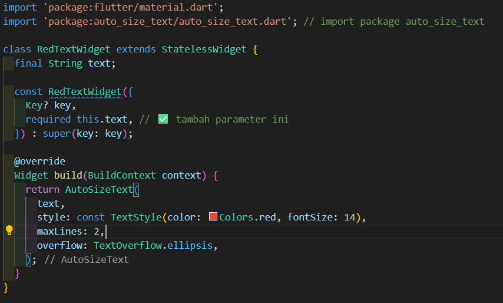
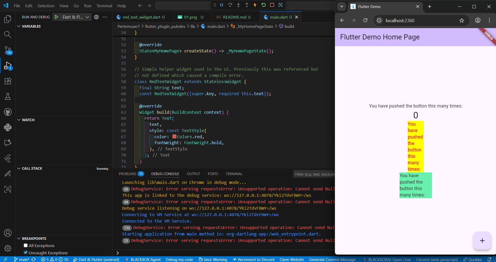

# Manajemen Plugin

Mengelola plugin di flutter

 kode error karena belum mengimport package

## Tugas
1. maksud dari langkah 2 pada praktikum
 menambahkan plugin auto size text ke dalam projek flutter

2. maksud dari langkah 5
membuat variabel text

3. langkah 6 terdapat dua widget yang ditambahkan
fungsi nya untuk menambahkan text dengan 2 style yang berbedar dari plugin auto size text

4. maksud dari tiap parameter yang ada di dalam plugin auto_size_text
key : untuk mengidentifikasi widget dalam tree agar bisa mengelola perubahan
style : untuk Menentukan ukuran dasar font, warna, dan atribut teks lainnya 