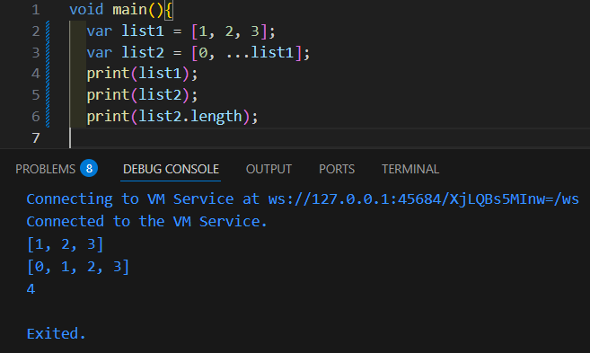
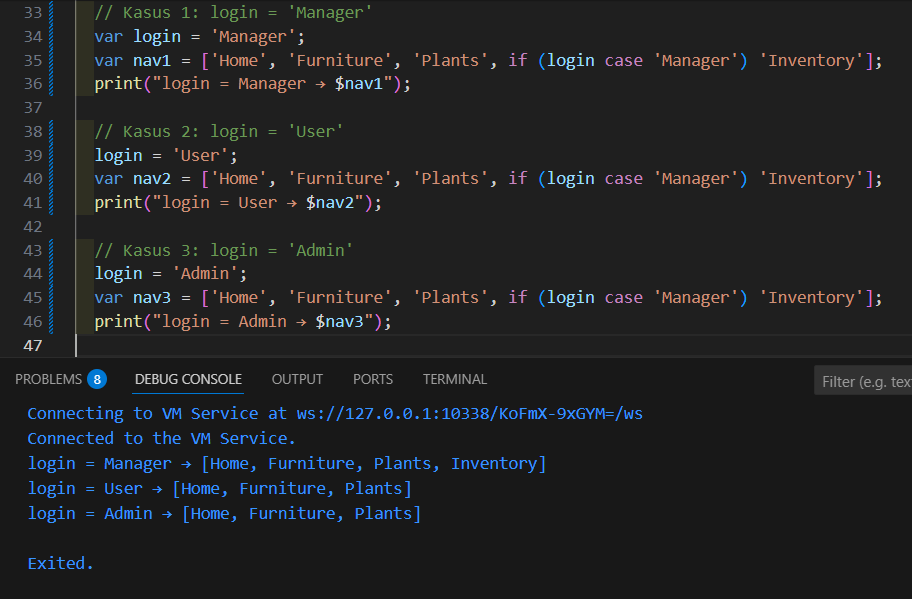

# Laporan Praktikum Dart - Functions
## 1. Silakan selesaikan Praktikum 1 sampai 5, lalu dokumentasikan berupa screenshot hasil pekerjaan Anda beserta penjelasannya!








## 1. Functions dalam bahasa Dart
Function adalah blok kode yang bisa dipanggil kembali untuk menjalankan tugas

```dart
// Fungsi sederhana
int tambah(int a, int b) {
  return a + b;
}

void main() {
  print(tambah(3, 4)); // output: 7
}
```

---

## 2. Jenis-jenis Parameter di Functions

### a. Positional Parameters (wajib urut)
```dart
void sapa(String nama, int umur) {
  print("Halo $nama, umur $umur tahun");
}

void main() {
  sapa("Tora", 21);
}
```

### b. Optional Positional Parameters (`[]`)
```dart
void sapa(String nama, [int? umur]) {
  print("Halo $nama, umur ${umur ?? 'tidak diketahui'}");
}

void main() {
  sapa("Tora");
  sapa("Tora", 21);
}
```

### c. Named Parameters (`{}`)
```dart
void sapa({required String nama, int umur = 0}) {
  print("Halo $nama, umur $umur tahun");
}

void main() {
  sapa(nama: "Tora", umur: 21);
}
```

### d. Default Parameters
```dart
void greet([String nama = "Guest"]) {
  print("Halo $nama!");
}

void main() {
  greet();
  greet("Tora");
}
```

---

## 3. Functions sebagai First-Class Objects
Function diperlakukan seperti objek biasa → bisa disimpan dalam variabel, dijadikan parameter, atau dikembalikan.

```dart
void kaliDua(int x) {
  print(x * 2);
}

void jalankan(Function f, int nilai) {
  f(nilai);
}

void main() {
  var fungsi = kaliDua; // fungsi jadi variabel
  fungsi(5);            // output: 10

  jalankan(kaliDua, 7); // output: 14
}
```

---

## 4. Anonymous Functions
Anonymous function = function tanpa nama, biasanya dipakai di callback.

```dart
void main() {
  var list = [1, 2, 3];
  
  list.forEach((item) {
    print(item * 2);
  });
}
```

Output:
```
2
4
6
```

---

## 5. Lexical Scope vs Lexical Closures

### a. Lexical Scope
Variabel hanya bisa diakses dalam scope tempat dia dibuat.

```dart
void main() {
  var a = 10;

  void tampil() {
    print(a); // bisa diakses
  }

  tampil();
}
```

### b. Lexical Closures
Closure = function yang tetap mengingat variabel dari scope asalnya.

```dart
Function buatCounter() {
  var hitung = 0;

  return () {
    hitung++;
    return hitung;
  };
}

void main() {
  var counter = buatCounter();
  print(counter()); // 1
  print(counter()); // 2
  print(counter()); // 3
}
```

---

## 6. Return Multiple Value di Functions

### Menggunakan List
```dart
List<int> hitung(int a, int b) {
  return [a + b, a - b];
}

void main() {
  var hasil = hitung(10, 5);
  print("Tambah: ${hasil[0]}, Kurang: ${hasil[1]}");
}
```

### Menggunakan Record (Dart 3)
```dart
(int, int) hitung(int a, int b) {
  return (a + b, a - b);
}

void main() {
  var (jumlah, selisih) = hitung(10, 5);
  print("Tambah: $jumlah, Kurang: $selisih");
}
```

Output:
```
Tambah: 15, Kurang: 5
```
